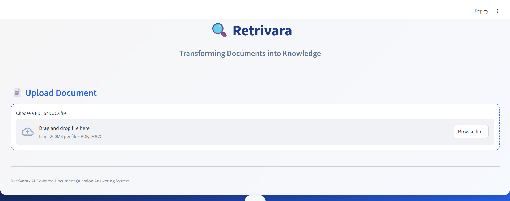
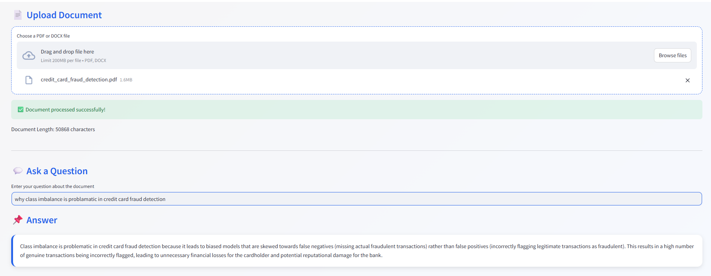

# 🔍 Retrivara

### Transforming Documents into Knowledge

Retrivara is an AI-powered Document Question Answering System built using Retrieval-Augmented Generation (RAG). It enables users to upload PDF and DOCX documents, ask questions in natural language, and receive context-aware answers generated from the document content.

The application combines document processing, semantic search, vector databases, and Large Language Models (LLMs) to provide accurate responses grounded in the uploaded documents.

---

## 📸 Application Preview

### Home Page

<p align="center">
  
</p>

### Question Answering Interface

<p align="center">
  
</p>

---

## ✨ Features

* Upload PDF and DOCX documents
* Extract and process document content
* Intelligent text chunking
* Semantic search using vector embeddings
* Retrieval-Augmented Generation (RAG)
* Context-aware document question answering
* Local LLM inference using Ollama
* Interactive Streamlit-based user interface

---

## 🛠️ Technology Stack

| Component       | Technology            |
| --------------- | --------------------- |
| Frontend        | Streamlit             |
| Framework       | LangChain             |
| Embeddings      | Sentence Transformers |
| Vector Database | ChromaDB              |
| LLM             | Ollama (Llama 3.1)    |
| PDF Processing  | PyPDF                 |
| DOCX Processing | python-docx           |

---

## 🏗️ System Architecture

```text
Document Upload
      │
      ▼
Text Extraction
      │
      ▼
Text Chunking
      │
      ▼
Embedding Generation
      │
      ▼
ChromaDB Vector Store
      │
      ▼
Retriever
      │
      ▼
Ollama LLM
      │
      ▼
Answer Generation
```

---

## 📂 Project Structure

```text
Retrivara/
│
├── main.py
├── document_extractor.py
├── text_splitter.py
├── vector_store.py
├── rag_chain.py
│
├── requirements.txt
├── README.md
│
└── chroma_db/
```

---

## 🚀 Installation

### 1. Clone the Repository

```bash
git clone https://github.com/Varsha-Tamilselvan/Retrivara.git
cd Retrivara
```

### 2. Install Dependencies

```bash
pip install -r requirements.txt
```

### 3. Install Ollama

Download and install Ollama from:

https://ollama.com

Pull the required model:

```bash
ollama pull llama3.1
```

Start Ollama:

```bash
ollama serve
```

### 4. Run the Application

```bash
streamlit run main.py
```

Open your browser and navigate to:

```text
http://localhost:8501
```

---

## 💡 Example Questions

* What is the main objective of this document?
* Summarize the key findings.
* What methodology is described in the document?
* List the important conclusions.
* What are the key technologies mentioned?

---

## 👩‍💻 Author

**Varsha **

Master's Student in Data Science

Areas of Interest:

* Artificial Intelligence
* Machine Learning
* Generative AI
* Computational Biology
* Healthcare Analytics
